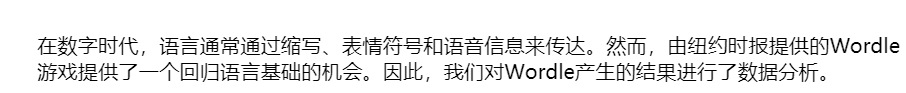
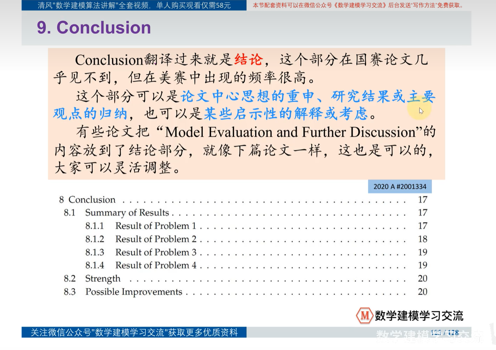

# 写在前面

**方向决定模型，模型决定书写过程**，所以要先做计划，再开始下笔，美赛要留出一天的时间整理论文，摘要咬文嚼字

定颜色

看论文要学习以下几点：

1. 提出假设 & 说明理由部分
2. 建模时了解模型的优缺点
3. 论文的结构

注重自己的节奏

<u>摘要：</u>

n+1（n==子问题的个数，子问题就是拆的最小的，同时子问题都是单开一个标题）

第一段：

总结（背景引入、主题）+意义（为...提供科学的依据/为...提供合理的方案），3句话

第二段：

针对第一个问题，==一定要把最终的结果展示出来==

# C

2300348

2307946

2318036

### 写信总结：

### 问题重述：问题可拆分（预测变化，研究影响）

### summary：

==层次清晰+有结果，能写就写上，写不出来就说，它被展示在表几或者图几里面==

不要有公式，除非极为特殊的情况，让你直接求解公式

字母+数字

可以有新开段落讲述自己的创新点

开头先要说明罗列使用到的模型

关键词可以加粗

~~~
模型名称--单词驼峰式
重要结果--
      1.题目要求的
      2.模型的评测--相对误差率，相对RESE，表现模型预测的准确         性良好
步骤关键词
分类等关键做法，可以只加粗类别个数 
~~~

将数据展示出来，括号标注表格排序

<u>第一段：</u>就是简单的概述背景，最好在一句话之内讲完：

可以学习这种三段论，先讲世界大背景，然后讲转折到该话题上（提出问题）.

However   Thus

<u>后续</u>

~~~
第一种：先后顺序（按照过程可以对小问进行拆分）
~~~

1. 模型构建类

   ==讲解细致，带上必要数据==

     <u>建立模型解决问题</u>（we ...to ...）--模型运用方法(一句话)--准确率/其他<u>评价</u>体系--最终<u>结果</u>

   

   详细版--重要性+模型本身：

   添加了参数输入

   

2. 数据分析类

3.   关键词：（空行）

   驼峰式、按照顺序各个步骤的主要模型

   关键词可以是问题、模型、算法等，一般5-6个
   
   

### Intro

However  But

配图

### Restatement of the Problem问题重述

讲清楚目的：

（1）

（2）

并回答以下问题：

不拘泥于原问题，而是依据解决的具体问题，分点

祈使句

可以参照下面这个格式，好一些：

内容：

理解了以后，简明扼要地用自己的语言阐述

###### （评估的方法！

你对模型预测的信心/证明你的模型提供了最佳策略 == 测试模型的性能：

模型的泛化能力+（收益率）+鲁棒性

~~~
使用噪声数据集比较不同交易策略的性能，以说明我们模型的优势；

在机器学习和数据分析中，使用噪声数据集有助于测试算法的稳健性、泛化能力和对异常情况的处理能力。同时，研究者还可以通过引入不同类型和程度的噪声，更好地理解算法的局限性和适用范围。
~~~

（环境）对（模型的结果元素）的影响 / 模型结果的敏感程度==评估模型的稳定性

（敏感性+鲁棒性）

### our work --

**与问题重述相对应**

1.只要图

按模型/部分--分大类--中间画流程图

---------------------------------------------------------------------------

### Assumptions& Notations：（可拆分）（？Justification）

后面要加上**理由**

#### Notation  表格：

  三线表

  表头可以标色，注意色彩统一

指代明确

+ 如果有很多，可以按照模型分板块

+ 

### 模型：

简单理由--为什么需要解决这个问题--讲述用模型去解决问题这个过程，在这个之前可以说点其他的（和前文联合/和背景联合）

#### 原理：

~~~
流程图（插在中间）
方程的字母如果多了，用表格
（强调GSRF算法的优势，特别是在处理超参数时）
~~~

------------------------------------------------------------------------

==擅用表格！--显示数据呀，结果呀，参数组合呀==

--------------------------------------------------------------------------

#### 模型应用--

可以用目的命名：

这种方法：

（按流程）

另一种方法：

  (重要参数)

另一种方法；添加数据预处理

一步一步讲细致

可以举例子来说明，像这种来解释抽象的处理过程：

预测评价分析（机器学习）

###### 公式：

 is 
where（分点）

###### Python库--代码--模型

附件excel

###### 算法步骤

表格下方是对步骤中字母意思的解释

注意缩进

##### 模型评价

1.以<u>模型为单位</u>做评价--只是一个定位，不仅分析模型，还分析了人的操作

##### 

### Sensitive analysis灵敏度分析

### Conclusion:

### Reference&Appendices:

首先是参考文献，都要自己翻译成英文

然后就是如果要粘贴代码，一定注意不要有中文的注释！！！

因为美赛的要求是不能暴露队伍的具体信息

然后就是一定要写到足够页数，我觉得22页差不多，因为还可能有memo这种东西，然后以防万一再来一页代码。

# 校赛

1. 设置的参数也可以建立表格

   

2. 

3. Our  work部分

   

